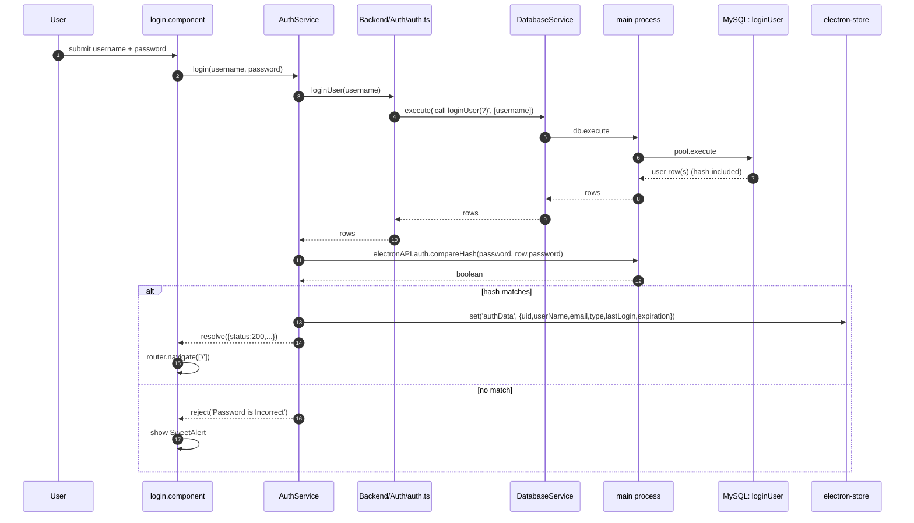
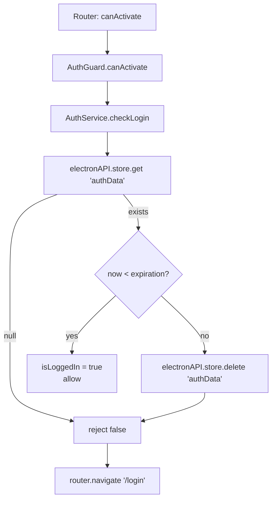

# Authentication flow

There is no auth server. Users authenticate against rows in the local `users`
table; sessions live in `electron-store`. This document describes the intended
post-modernization flow, where bcrypt runs in the main process.

## Actors

- **Renderer** - `client/app/modules/login/` component + `AuthService` at
  `client/app/shared/services/Auth/auth.service.ts`.
- **Auth Backend** - `Backend/Auth/auth.ts`, a thin wrapper around
  `call loginUser(?)`.
- **Main process** - owns `bcryptjs.compare` and the `electron-store` handle.
- **MySQL** - `users` table + `loginUser` stored procedure.

## Sequence



## `authData` shape

Stored under key `authData` in `electron-store`:

```ts
{
  uid: number;         // users.uid
  userName: string;
  email: string;
  type: 'admin' | 'manager' | 'employee';
  lastLogin: string;   // ISO string from users.last_login_date
  expiration: string;  // ISO string, now + 24h
}
```

## Session expiration and the guard

Every navigation to a protected route passes through
[`client/app/guards/AuthGuard/auth.guard.ts`](../../client/app/guards/AuthGuard/auth.guard.ts):



Expiration is a hard 24-hour window from login. There is no sliding renewal.
The check is client-side only; the database has no session concept.

## Logout

`AuthService.logout()`:

1. Logs `logout()` info to `electron-log`.
2. Deletes `authData` from `electron-store`.
3. Sets `isLoggedIn` signal to `false`.
4. Navigates to `/login`.

## Threat notes

- Bcrypt work factor is baked into the seed hash at cost 10. When creating new
  users, the same cost is applied via `auth.generateHash`.
- The plaintext password briefly lives in the renderer (typed into the form) and
  is passed as the first argument to `auth.compareHash`. It never touches disk.
- The password hash itself flows across IPC from main -> renderer as part of the
  user row before being compared. This is acceptable for a same-machine desktop
  app but should be reviewed if the pool ever moves to a network MySQL.
- The `JwtInterceptor` at `client/app/helpers/Http-Interceptor/jwt.interceptor.ts`
  is dead code - no HTTP requests exist for it to intercept. Removal is a Phase 6
  cleanup.

See [`../security/hardening-checklist.md`](../security/hardening-checklist.md)
for the follow-up items.
