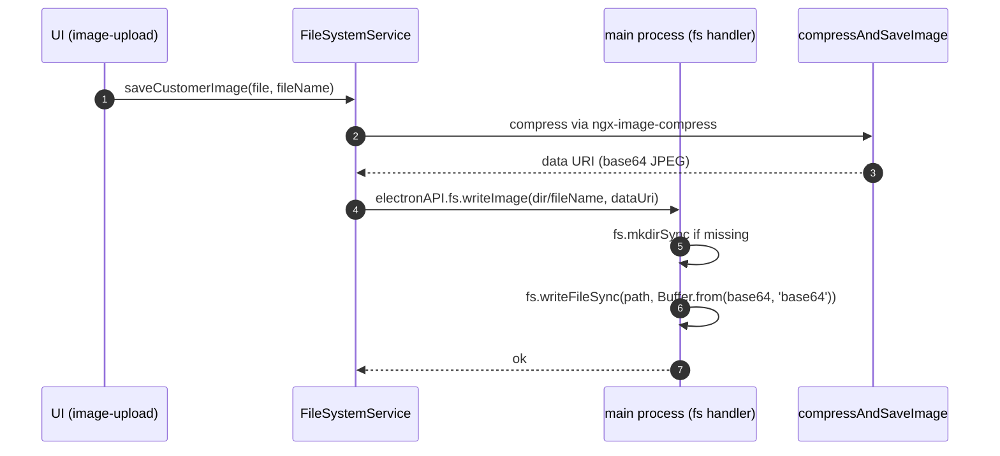

# File storage

All uploaded images (customer profiles, product photos, user avatars) are stored
on the local filesystem, not in MySQL. Only the **filename** is stored in the
database (`imagePath` column on each of the `users`, `customers`, and `products`
tables). At read time the main process resolves the filename against the
Pictures directory and streams the bytes back to the renderer as a base64 data
URI.

## Directory layout

The root is `app.getPath('pictures')` (a per-platform Electron API):

| Platform | Root directory                              |
| -------- | ------------------------------------------- |
| Windows  | `C:\Users\<user>\Pictures`                  |
| macOS    | `~/Pictures`                                |
| Linux    | `~/Pictures` (via XDG user dirs, if set)    |

Under that root the app creates a fixed subtree:

```
Pictures/
  Jewellery-Store-Management-System/
    customerImages/
      <customerGuid>-customer-<originalName>
    productImages/
      <unixTimestamp>-product-<productGuid>.<ext>
    userImages/
      <userId>-user-<originalName>
```

The subdirectories are created lazily on first write (each `save*Image` method
in
[`Backend/Shared/file-system.service.ts`](../../Backend/Shared/file-system.service.ts)
does an `fs.existsSync` / `fs.mkdirSync` pair). If you back up the database
without also backing up this directory tree, all image links break.

## Naming convention

The filename baked into the database is generated by the corresponding
`update*Image` stored procedure (or by `add_customer` / `add_product` on
create). Formats:

| Kind     | Format                                                          |
| -------- | --------------------------------------------------------------- |
| Customer | `<customerGuid>-customer-<originalFilename>`                    |
| Product  | `<unixTimestamp>-product-<productGuid>.<extension>`             |
| User     | `<userId>-user-<originalFilename>` (stored under `users.imagePath`) |

The exact string returned from the SP is the value the renderer must resolve
against the corresponding directory.

## Write path



Compression uses `ngx-image-compress` at DOC_ORIENTATION.Default with quality
50 and ratio 60 (see `FileSystemService.compressAndSaveImage`). Images are
always re-encoded as JPEG.

## Read path

```mermaid
sequenceDiagram
  autonumber
  participant U as UI (view-details)
  participant FS as FileSystemService
  participant M as main process (fs handler)

  U->>FS: getCustomerImageInBase64(fileName)
  FS->>M: electronAPI.fs.readImage(dir/fileName)
  M->>M: fs.readFileSync -> Buffer
  M-->>FS: 'data:image/jpeg;base64,' + b64
  FS-->>U: dataUri
```

## Delete path

Delete is called when a record is being replaced (update) or removed
(hard-delete):

- `deleteFileIfExists` uses `fs.existsSync` + `fs.unlinkSync`.
- `update*Image` methods delete the old file **before** writing the new one.
- `delete*Image` methods are exposed separately for the "remove picture" flow.
- Soft-deleted customers / products **do not** remove the image file; the file
  is left in place so a future undelete can rehydrate it.

## Common pitfalls

- **Cross-platform paths.** The current implementation builds paths with
  hard-coded backslashes (e.g. `${dir}\\${fileName}`). On macOS/Linux this
  produces invalid paths. Windows is the only fully-supported platform until
  path handling is normalized via `path.join`.
- **No integrity check.** If a filename is present in the DB but the file is
  missing on disk, `fs.readFileSync` throws. The read path lets the error
  propagate to the caller; the UI shows a broken image or an error toast.
- **Orphan files.** A DB delete rolls the record back but does not remove the
  image file. Periodic cleanup (Phase 6+) should sweep files whose base name
  does not correspond to any live `imagePath`.
