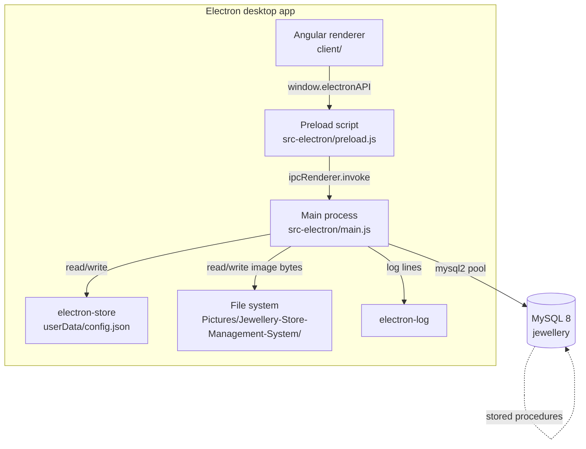

# High-level architecture

The application is a **thick-client desktop app**. There is no web server, no HTTP
API layer, and no cloud dependency at runtime. Data lives in a local MySQL 8
database that the desktop shell connects to directly.

## Components

## Boundaries

- **Renderer** contains the Angular application: components, guards, services,
  routing. It never touches Node APIs directly. Every side effect (DB, disk,
  hashing, logging, app lifecycle) crosses the IPC boundary.
- **Preload** exposes a **narrow, whitelisted** `window.electronAPI` surface via
  `contextBridge.exposeInMainWorld`. See
  [`process-model.md`](./process-model.md) for the full method inventory.
- **Main process** owns Node-only resources: the MySQL pool, `electron-store`,
  `bcryptjs` hashing, `fs` reads/writes for image files, `electron-log`, and app
  window lifecycle.
- **MySQL** is the sole persistent store for structured data. All CRUD flows are
  implemented as stored procedures under `Scripts/Stored-Procedures/`; the Backend
  services in `Backend/` just call them via `CALL <procName>(?, ?, ...)`.
- **Filesystem** holds compressed JPEG images (customer / product / user
  profile). Path is derived from `app.getPath('pictures')`.

## Guiding principles

1. **Renderer is untrusted.** `contextIsolation: true`, `nodeIntegration: false`,
   `webSecurity: true`. All privileged actions go through the preload bridge.
2. **Business logic lives in stored procedures.** The renderer's Backend service
   layer is thin - it composes procedure calls and unpacks multi-resultset
   responses via `DatabaseService.prepareResponseData`.
3. **No HTTP surface.** Even though Angular has `HttpClient` wired up, there is
   no server to talk to. The `HttpClient` provider is registered only because
   `JwtInterceptor` still exists (dead-code candidate for Phase 6).
4. **Offline-first.** The app must be usable without any network. The only
   network dependency is the MySQL connection, which typically runs on the same
   machine.

## Feature areas

| Area          | Angular module                             | Backend service                             | SP folder                                                  |
| ------------- | ------------------------------------------ | ------------------------------------------- | ---------------------------------------------------------- |
| Login         | `client/app/modules/login`                 | `Backend/Auth/auth.ts`                      | `Scripts/Stored-Procedures/Auth`                           |
| Dashboard     | `client/app/modules/dashboard`             | mixed (orders, categories, inventory)       | `Scripts/Stored-Procedures/Orders`, `Categories`, `Inventory` |
| Customers     | `client/app/modules/customers`             | `Backend/Customers/db-customers.service.ts` | `Scripts/Stored-Procedures/Customers`                      |
| Inventory     | `client/app/modules/inventory`             | `Backend/Inventory/db-inventory.service.ts` | `Scripts/Stored-Procedures/Inventory`                      |
| Orders        | `client/app/modules/orders`                | `Backend/Orders/db-orders.service.ts`       | `Scripts/Stored-Procedures/Orders`                         |
| Categories    | `client/app/modules/categories`            | `Backend/Categories/*.service.ts`           | `Scripts/Stored-Procedures/Categories`                     |
| Profile       | `client/app/modules/profile`               | `Backend/Users/db-user.service.ts`          | `Scripts/Stored-Procedures/Users`                          |
| Settings      | `client/app/modules/settings`              | `StoreService` + `DatabaseService`          | (no procs; touches `electron-store`)                       |

See [`module-map.md`](./module-map.md) for the exhaustive mapping.
