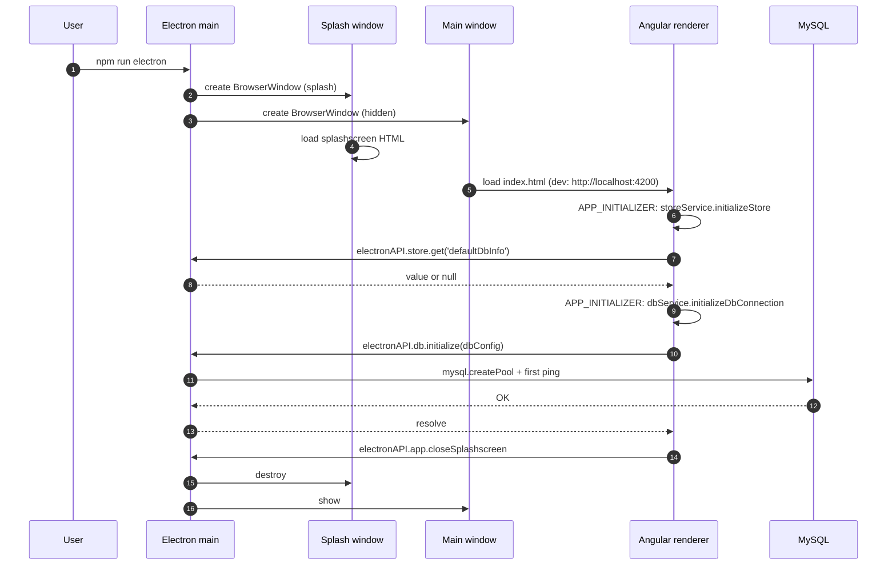

# Process model

Electron splits every desktop app into a **main process** (Node.js, one instance
per app) and one or more **renderer processes** (Chromium page, sandboxed). This
project uses exactly two windows - a splash and the main app window - both driven
by the same renderer bundle.

## Renderer

- Loads the Angular 19 SPA (`client/main.ts` bootstrap).
- Runs with **Chromium sandbox on**, no Node APIs available in the page:
  - `nodeIntegration: false`
  - `contextIsolation: true`
  - `webSecurity: true`
- The only bridge to privileged code is `window.electronAPI`, exposed by the
  preload script.

## Preload script

`src-electron/preload.js` runs before the renderer's page scripts, in a Node
context, with `contextIsolation` enforced. It uses `contextBridge.exposeInMainWorld`
to publish a whitelisted API. The renderer sees this as:

```ts
declare global {
  interface Window {
    electronAPI: {
      db: {
        initialize(config: DbConfig): Promise<void>;
        execute(sql: string, values: unknown[]): Promise<unknown[]>;
        query(sql: string): Promise<unknown[]>;
      };
      store: {
        get(key: string): Promise<unknown>;
        set(key: string, value: unknown): Promise<boolean>;
        delete(key: string): Promise<boolean>;
      };
      auth: {
        compareHash(plaintext: string, hash: string): Promise<boolean>;
        generateHash(plaintext: string): Promise<string>;
      };
      fs: {
        getPicturesDirectory(): Promise<string>;
        writeImage(absPath: string, dataUri: string): Promise<void>;
        readImage(absPath: string): Promise<string>; // returns data URI
        deleteImage(absPath: string): Promise<void>;
      };
      logger: {
        info(msg: string): void;
        error(msg: string): void;
      };
      app: {
        relaunch(): Promise<void>;
        closeSplashscreen(): Promise<void>;
      };
    };
  }
}
```

Each method is a thin `ipcRenderer.invoke('<channel>', ...args)` call. The
renderer must not import `mysql2`, `electron-store`, `bcryptjs`, `fs`, or
`electron-log` directly - those imports would fail with `contextIsolation` on.

## Main process

`src-electron/main.js` owns:

- **BrowserWindow lifecycle** - hidden main window, splash window, close &
  cleanup.
- **MySQL pool** - a single `mysql2/promise` pool instance created on first
  `db:initialize`. Configuration: `connectionLimit: 10`, `waitForConnections:
  true`, `queueLimit: 0`, `enableKeepAlive: true`, `keepAliveInitialDelay: 10000`.
- **electron-store** - opened once on app ready.
- **bcryptjs** - `hash` / `compare` run here so the CPU cost stays out of the
  renderer's UI thread and the salt lives in a Node context.
- **File I/O** - reads and writes image files under
  `app.getPath('pictures')/Jewellery-Store-Management-System/{customer,product,user}Images/`.
- **electron-log** - all `info`/`error` lines requested by the renderer end up
  through the same log file.

The main process registers `ipcMain.handle('<channel>', handler)` for every
channel listed in the preload table above.

## IPC channel inventory

| Channel                 | Direction        | Payload                       | Reply                     |
| ----------------------- | ---------------- | ----------------------------- | ------------------------- |
| `db:initialize`         | renderer -> main | `{host,user,password,database,port}` | resolves on success       |
| `db:execute`            | renderer -> main | `(sql, values)`               | flattened row array       |
| `db:query`              | renderer -> main | `(sql)`                       | flattened row array       |
| `store:get`             | renderer -> main | `key`                         | value or `null`           |
| `store:set`             | renderer -> main | `key, value`                  | `true`                    |
| `store:delete`          | renderer -> main | `key`                         | `true`                    |
| `auth:compareHash`      | renderer -> main | `plaintext, hash`             | boolean                   |
| `auth:generateHash`     | renderer -> main | `plaintext`                   | hash string               |
| `fs:getPicturesDirectory` | renderer -> main | -                            | absolute path             |
| `fs:writeImage`         | renderer -> main | `absPath, dataUri`            | resolves on success       |
| `fs:readImage`          | renderer -> main | `absPath`                     | `data:image/jpeg;base64,...` |
| `fs:deleteImage`        | renderer -> main | `absPath`                     | resolves on success       |
| `logger:info`           | renderer -> main | `msg`                         | fire-and-forget           |
| `logger:error`          | renderer -> main | `msg`                         | fire-and-forget           |
| `app:relaunch`          | renderer -> main | -                             | -                         |
| `app:closeSplashscreen` | renderer -> main | -                             | -                         |

## Startup sequence



If `db:initialize` fails, the renderer catches the error, shows a SweetAlert2
dialog, and routes to `/settings` - the user can supply new credentials from the
UI without editing files.
