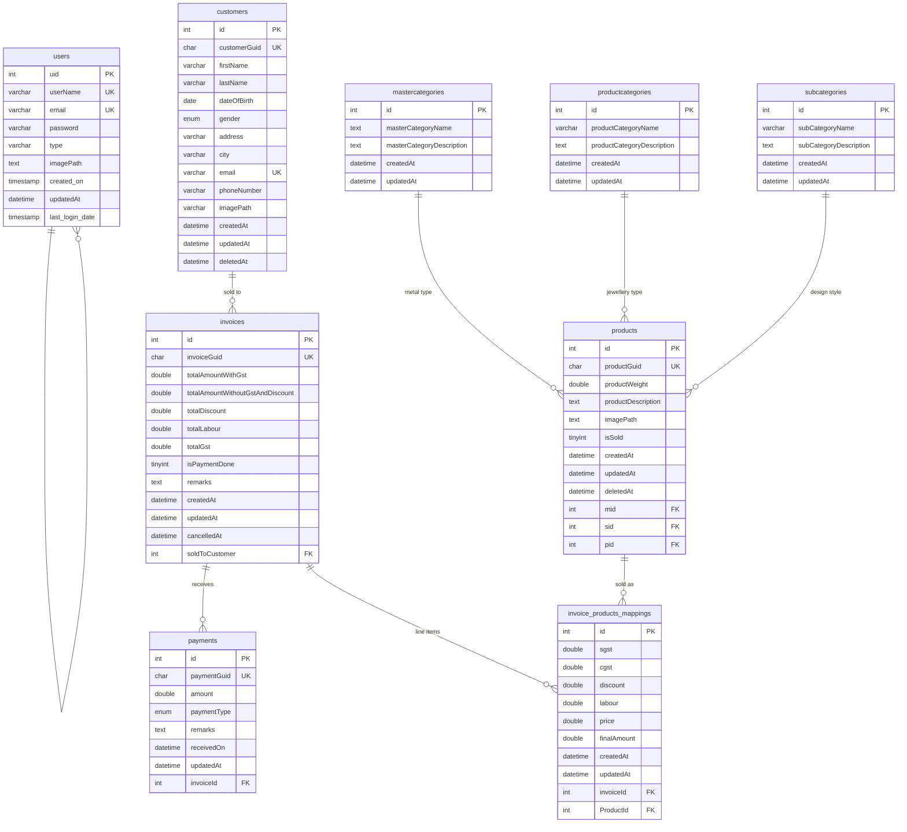

# Database schema

The application uses a single MySQL 8.0 database (default name `jewellery`,
InnoDB, `utf8mb4_0900_ai_ci`). All DDL lives under `Scripts/Tables/`; index
additions and other structural tweaks live under `Scripts/Migrations/`.

## Entity-relationship diagram

## Table reference

### `users`

Application login accounts. Passwords are bcrypt hashes.

| Column          | Type           | Notes                                       |
| --------------- | -------------- | ------------------------------------------- |
| `uid`           | INT PK AI      |                                             |
| `userName`      | VARCHAR(50)    | UNIQUE                                      |
| `email`         | VARCHAR(100)   | UNIQUE                                      |
| `password`      | VARCHAR(255)   | bcrypt hash                                 |
| `type`          | VARCHAR(50)    | `admin`, `manager`, `employee`              |
| `imagePath`     | TEXT           | filename under `userImages/`                |
| `created_on`    | TIMESTAMP      | default `CURRENT_TIMESTAMP`                 |
| `updatedAt`     | DATETIME       | on update `CURRENT_TIMESTAMP`               |
| `last_login_date` | TIMESTAMP    | nullable; set by `loginUser`                |

DDL: [`Scripts/Tables/Users.sql`](../../Scripts/Tables/Users.sql).

### `customers`

Retail customer records with soft-delete.

| Column         | Type              | Notes                                    |
| -------------- | ----------------- | ---------------------------------------- |
| `id`           | INT PK AI         |                                          |
| `customerGuid` | CHAR(36) BIN      | UUID; unique index added via migration V001 |
| `firstName`    | VARCHAR(80)       |                                          |
| `lastName`     | VARCHAR(80)       |                                          |
| `dateOfBirth`  | DATE              | nullable                                 |
| `gender`       | ENUM('male','female') |                                      |
| `address`      | VARCHAR(150)      | nullable                                 |
| `city`         | VARCHAR(50)       |                                          |
| `email`        | VARCHAR(100)      | UNIQUE, nullable                         |
| `phoneNumber`  | VARCHAR(20)       |                                          |
| `imagePath`    | VARCHAR(255)      | filename under `customerImages/`         |
| `createdAt`    | DATETIME          | default `CURRENT_TIMESTAMP`              |
| `updatedAt`    | DATETIME          | on update                                |
| `deletedAt`    | DATETIME          | nullable; soft-delete marker             |

DDL: [`Scripts/Tables/Customers.sql`](../../Scripts/Tables/Customers.sql).

### `mastercategories`

Metal type - e.g. Gold, Silver, Diamond, Platinum.

| Column | Type | Notes |
| ------ | ---- | ----- |
| `id`   | INT PK AI |  |
| `masterCategoryName` | TEXT | |
| `masterCategoryDescription` | TEXT | nullable |
| `createdAt` / `updatedAt` | DATETIME |  |

DDL: [`Scripts/Tables/MasterCategories.sql`](../../Scripts/Tables/MasterCategories.sql).

### `productcategories`

Jewellery type - e.g. Necklace, Ring, Earring, Bracelet.

| Column | Type | Notes |
| ------ | ---- | ----- |
| `id`   | INT PK AI |  |
| `productCategoryName` | VARCHAR(255) | indexed |
| `productCategoryDescription` | TEXT | nullable |
| `createdAt` / `updatedAt` | DATETIME |  |

DDL: [`Scripts/Tables/ProductCategories.sql`](../../Scripts/Tables/ProductCategories.sql).

### `subcategories`

Design style - e.g. Traditional, Modern, Antique, Bridal.

| Column | Type | Notes |
| ------ | ---- | ----- |
| `id`   | INT PK AI |  |
| `subCategoryName` | VARCHAR(255) | indexed |
| `subCategoryDescription` | TEXT | nullable |
| `createdAt` / `updatedAt` | DATETIME |  |

DDL: [`Scripts/Tables/SubCategories.sql`](../../Scripts/Tables/SubCategories.sql).

### `products`

Product / SKU records. Each product carries three FKs into the category tables.

| Column | Type | Notes |
| ------ | ---- | ----- |
| `id`   | INT PK AI |  |
| `productGuid` | CHAR(36) BIN | UNIQUE (`products_product_guid`) |
| `productWeight` | DOUBLE | grams |
| `productDescription` | TEXT | nullable |
| `imagePath` | TEXT | filename under `productImages/` |
| `isSold` | TINYINT(1) | default 0 |
| `createdAt` / `updatedAt` | DATETIME |  |
| `deletedAt` | DATETIME | nullable; soft-delete |
| `mid` | INT FK | -> `mastercategories.id` |
| `sid` | INT FK | -> `subcategories.id`   |
| `pid` | INT FK | -> `productcategories.id` |

DDL: [`Scripts/Tables/Products.sql`](../../Scripts/Tables/Products.sql).

### `invoices`

An invoice = one order = one customer + one payment ledger. Line items live in
`invoice_products_mappings`.

| Column | Type | Notes |
| ------ | ---- | ----- |
| `id`   | INT PK AI |  |
| `invoiceGuid` | CHAR(36) BIN | UUID; unique index added via migration V001 |
| `totalAmountWithGst` | DOUBLE |  |
| `totalAmountWithoutGstAndDiscount` | DOUBLE |  |
| `totalDiscount` | DOUBLE |  |
| `totalLabour` | DOUBLE |  |
| `totalGst` | DOUBLE |  |
| `isPaymentDone` | TINYINT(1) | flipped by `record_payment` when total settled |
| `remarks` | TEXT | nullable |
| `createdAt` / `updatedAt` | DATETIME |  |
| `cancelledAt` | DATETIME | nullable; set by `cancel_order` |
| `soldToCustomer` | INT FK | -> `customers.id` |

DDL: [`Scripts/Tables/Invoices.sql`](../../Scripts/Tables/Invoices.sql).

### `invoice_products_mappings`

Join table between an invoice and its line items, with per-line tax / discount /
labour breakdown.

| Column | Type | Notes |
| ------ | ---- | ----- |
| `id`   | INT PK AI |  |
| `sgst` / `cgst` | DOUBLE | state / central GST per line |
| `discount` | DOUBLE |  |
| `labour` | DOUBLE | making-charge |
| `price` | DOUBLE | pre-tax, pre-discount |
| `finalAmount` | DOUBLE | line total |
| `createdAt` / `updatedAt` | DATETIME |  |
| `invoiceId` | INT FK | -> `invoices.id` ON DELETE CASCADE |
| `ProductId` | INT FK | -> `products.id` ON DELETE SET NULL |

Unique on `(invoiceId, ProductId)` so the same product cannot appear twice on
one invoice.

DDL: [`Scripts/Tables/Invoice_Products_Mapping.sql`](../../Scripts/Tables/Invoice_Products_Mapping.sql).

### `payments`

Payments recorded against an invoice. An invoice may have zero, one, or many.

| Column | Type | Notes |
| ------ | ---- | ----- |
| `id`   | INT PK AI |  |
| `paymentGuid` | CHAR(36) BIN | UUID; unique index added via migration V001 |
| `amount` | DOUBLE |  |
| `paymentType` | ENUM('cash','cheque','online') |  |
| `remarks` | TEXT | nullable |
| `receivedOn` | DATETIME | default `CURRENT_TIMESTAMP`; indexed |
| `updatedAt` | DATETIME | on update |
| `invoiceId` | INT FK | -> `invoices.id` ON DELETE CASCADE |

DDL: [`Scripts/Tables/Payments.sql`](../../Scripts/Tables/Payments.sql).

## Conventions

- **Soft-delete** is expressed via `deletedAt IS NULL` on `customers` and
  `products`. Queries must filter this out; the stored procedures generally do.
- **Guids** (`customerGuid`, `productGuid`, `invoiceGuid`, `paymentGuid`) are
  the external identifiers used by the renderer. They are UUIDs and unique.
  Migration V001 adds explicit unique indexes on all four.
- **Money columns** are `DOUBLE`. This is a known accuracy hazard; migrating to
  `DECIMAL(12, 2)` is a Phase 6+ candidate.
- **Timestamps** mix `TIMESTAMP` (`users`) and `DATETIME` (everything else).
  When comparing across tables be mindful that `TIMESTAMP` values are stored in
  UTC and converted on read, while `DATETIME` is stored verbatim.
